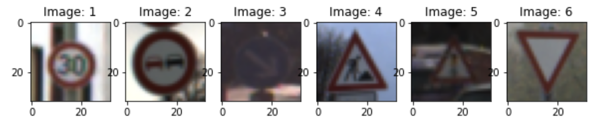
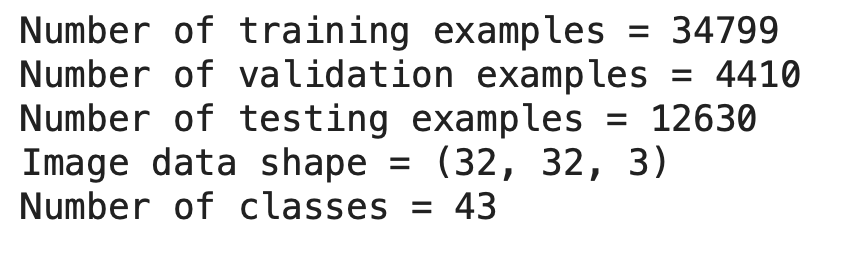
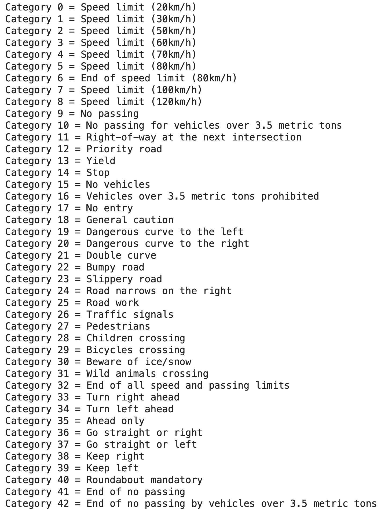
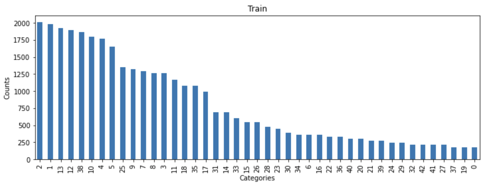
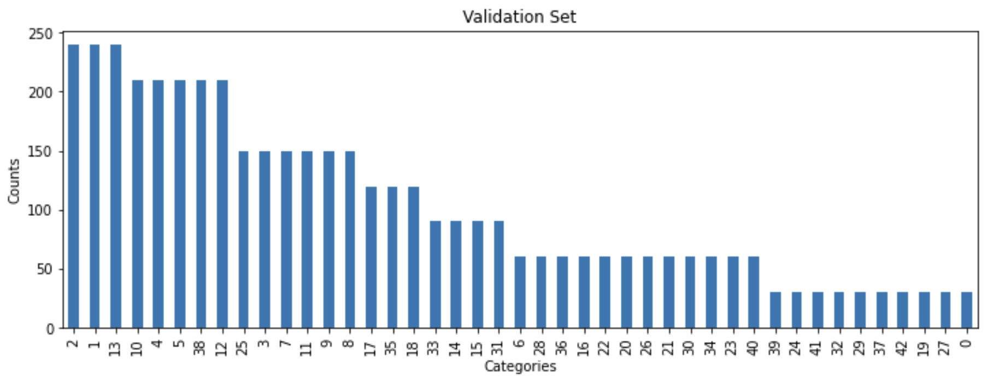
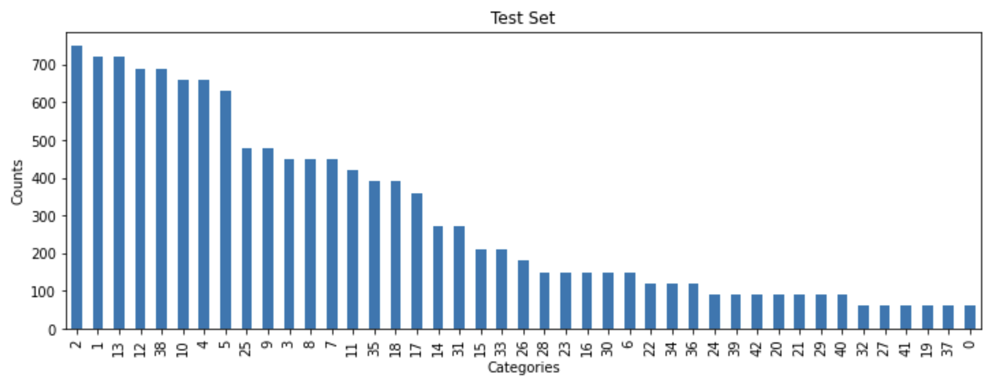
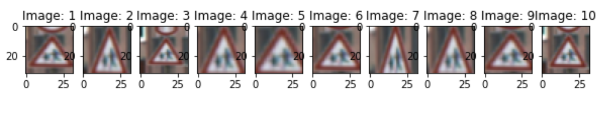
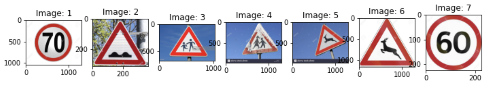
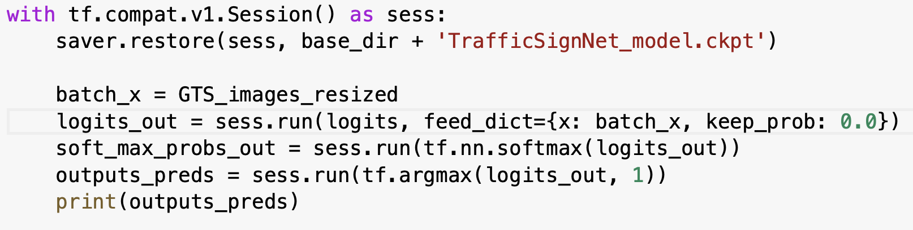
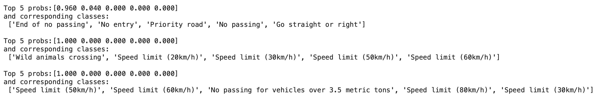

# SD-Car-Traffic-Signs-Classifier-P3
Udacity's Self-Driving Car Enginere Project #3 -- 'Traffic Sign Classifier' 

**Build a Traffic Sign Recognition Project**

The goals / steps of this project are the following:

* Load the data set and split into Training/Validation/Test sets
* Explore, summarize and visualize the data set
* Design, train and test a model architecture
* Use the model to make predictions on new images
* Analyze the softmax probabilities of the new images
* Summarize the results with a written report

### Data Set Summary & Exploration

Here are a few examples of Traffic Signs from the dataset:

*The stats below were calculated using numpy/pandas functionality.* 

A summary statistics of the traffic signs data set is provided below:

Below is a complete list of Traffic Signs categories: 

And here are the frequency/count plots of the categories for Train/Valid/Test sets 

As can be seen, the classes are significantly imbalanced. No extra work (e.g. class weighting or oversampling) was done to address that. For the purpose of comparing model performance on Training vs Valid/Test set this is acceptable given that distributions of classes for Train/Valid/Test sets are similar. 

### Design and Test a Model Architecture

#### Image Pre-Processing and Data Augmentation

A standard min-max scaling was applied to normalize images. This was compared against the suggested (pixel - 128)/ 128 method, and min-max scaling resulted in a better convergence. 

As for data augmentation, I have tried a few standard image transformations that make sense for the traffic signs images dataset. The following transformations were used to see if augmenting the data results in improved accuracy on the validation set:

* **Random Rotation** (*tf.keras.preprocessing.image.random_rotation(image, rg, channel_axis=2)* tensorflow/keras function). 
* **Random Brightness Shift** (*tf.keras.preprocessing.image.random_brightness(x, brightness_range)* keras function).
* **Random Zoom** (*tf.keras.preprocessing.image.random_zoom(x, zoom_range)*).

A random zoom transformation (*zoom_range=[0.5, 1.2]*) was eventually used during model training as it appeared to result in a better model generalization and a slightly improved accuracy on a test set. 

Example random zoom transformations are provided below:

#### Network Architecture

My final model consisted of the following layers:

| Layer         		|     Description	        					| 
|:---------------------:|:---------------------------------------------:| 
| Input         		| 32x32x3 RGB image   							| 
| Convolution 3x3 (32 maps)   + RELU 	| 1x1 stride, valid padding|
| Convolution 3x3 (32 maps)   + RELU	| 1x1 stride, valid padding|
| Max pooling	      	| 2x2 stride			|
| Convolution 3x3 (64 maps)   + RELU 	| 1x1 stride, valid padding|
| Convolution 3x3 (64 maps)   + RELU	| 1x1 stride, valid padding|
| Max pooling	      	| 2x2 stride			|
| Convolution 3x3 (128 maps)   + RELU 	| 1x1 stride, valid padding|
| Convolution 3x3 (128 maps)   + RELU	| 1x1 stride, valid padding|
| Max Pooling	      	| 2x2 stride			||
| Fully-Connected (flattenned)		|        			
| Logits/Classification				| 43 nodes  |

 

The network architecture is a standard CNN structure with exponentially increasing number of learned feature maps (as follows from the idea of growing feature complexity). A number of 2-by-2 Max pooling layers were also used to eventually reduce layer dimensions to a minimal size that is followed by a flattening layer and a single/final output layer (no intermediate fully-connected layers were used). 

#### Model Training and Performance

The model was trained with the following hyper-parameters: 

* Optimizer: Adam
* Batch Size: 128
* Epochs: 120
* Learning Rate: 5E-4

The values above were chosen manually and might not be optimal, but result in a good enough model performance. 

The network architecture was already discussed. The general idea is to increase/double number of feature maps to account for hierarchical feature complexity increase, while applying 2x2 max pooling (to both improve model's translational invariance as well as to progressively reduce the spatial size of the representation), to eventually reduce the spatial dimensions to a minimal size followed by layer flattening and a final classification layer. This is a fairly standard CNN architecture that results in good performance for other benchmark datasets (e.g. MNIST and CIFAR10).

The final model results were:

* **Training set accuracy of ~100%**
* **Validation set accuracy of ~99.3%**
* **Test set accuracy of ~98.4%**

Different variants of model architecrture were tried (number of layers, number of feature maps per CNN layer, 5x5 vs 3x3 filter size, number and size of fully-connected layers, etc.). 
Dropout rate was applied to the final/fully-connected layer. The most optimal dropout rate is 0.5. 
I have also tried using a SpatialDropout() method to CNN layers, which is more aggressive in that it drops an entire feature map (rather than a single node/pixel as in a regular Dropout()). 

The performance results demonstrate that, as is common with DL models, the model overfits with almost perfect accuracy for the training set and ~1.5% loss in accuracy for the test set. 

### Test a Model on New Images

Here are eight German traffic signs that I found on the web:

And here are the results of the prediction:

| Image			        |     Prediction	        					| 
|:---------------------:|:---------------------------------------------:| 
| Speed limit (70km/h)     			| Speed limit (70km/h) |
| Bumpy road					| Bumpy road	|
| Children crossing	      		| Children crossing|
| Children crossing				| Go straight or left     |
| Wild animals crossing |  End of no passing | 
| Wild animals crossing | Wild animals crossing |
| Speed limit (60km/h)| Speed limit (50km/h)|

The model was able to correctly guess 4 of the 7 traffic signs, which gives an accuracy of 57%. The accruacy is lower than that seen on a test set, which is not surprising given that some of the images are not anything that the model have seen during training. For example, the model was not able to correctly guess image number 4 (Children crossing), with non of the top-5 predictions including a correct label. 

The code for making predictions on my final model is provided below:

To further investigate model's perfromance, here is a summary of top-5 predictions for a few test/new images:  

For example, in the case of a last image, the model was close to a correct guess (predicted 50 km/h vs the actual 60km/h), with the top 5 predictions containing the correct label (although the model was almost certain about the final prediction; i.e. prob ~ 1.0).

