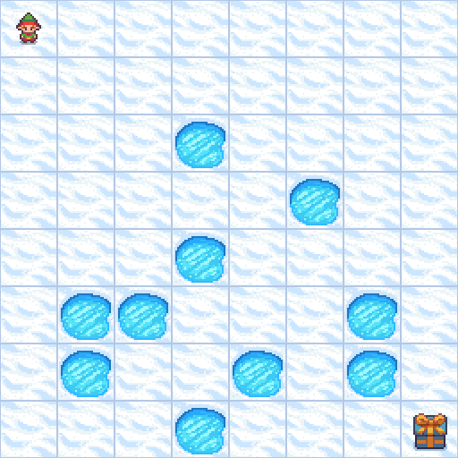
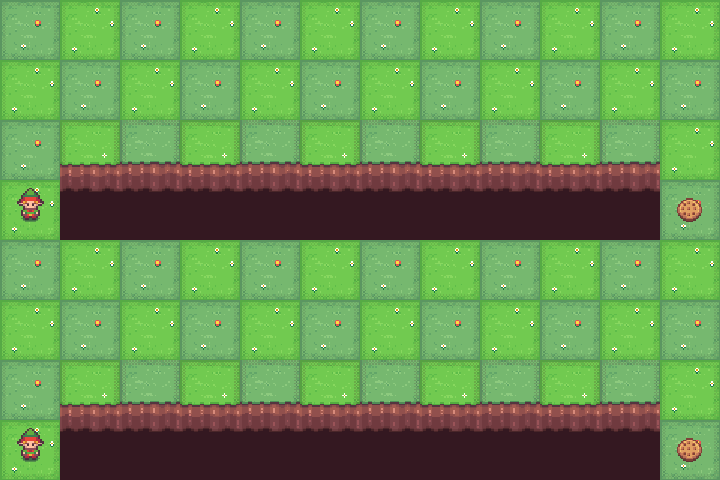
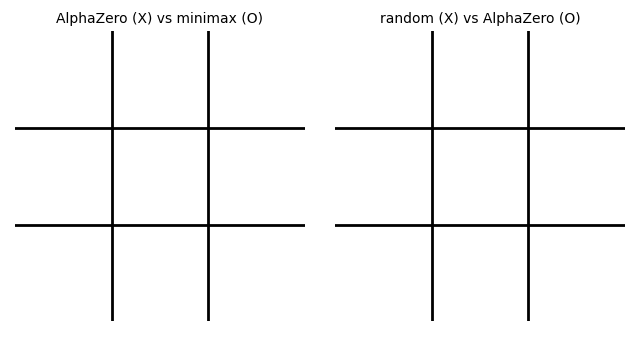

# Reinforcement Learning Tutorials

Eleven self-contained Jupyter notebooks, each covering one landmark reinforcement-learning algorithm: the theory
(with the math), a from-scratch implementation (NumPy or PyTorch), training on a small `gymnasium` task, and a
**visual demonstration** of the trained agent (a filmstrip in the notebook and an animated GIF in [`media/`](media/)).

The algorithms were chosen for historical significance and for their role in major breakthroughs, and the notebooks
are ordered so that each builds on ideas from the previous ones.

| # | Notebook | Algorithm | Key paper | Task | Demo |
|---|----------|-----------|-----------|------|------|
| 1 | [`dynamic_programming_tutorial.ipynb`](dynamic_programming_tutorial.ipynb) | Value iteration & policy iteration | Bellman 1957, Howard 1960 | FrozenLake 8×8 (slippery) |  |
| 2 | [`q_learning_tutorial.ipynb`](q_learning_tutorial.ipynb) | Q-learning (+ SARSA, Expected SARSA) | Watkins 1989; Rummery & Niranjan 1994 | CliffWalking, Taxi |  |
| 3 | [`reinforce_tutorial.ipynb`](reinforce_tutorial.ipynb) | REINFORCE (policy gradient) | Williams 1992 | CartPole |  |
| 4 | [`dqn_tutorial.ipynb`](dqn_tutorial.ipynb) | Deep Q-Network (+ Double DQN) | Mnih et al. 2013/2015 — Atari | CartPole |  |
| 5 | [`a2c_tutorial.ipynb`](a2c_tutorial.ipynb) | A2C / A3C (advantage actor-critic) | Mnih et al. 2016 | Acrobot |  |
| 6 | [`trpo_tutorial.ipynb`](trpo_tutorial.ipynb) | Trust Region Policy Optimization | Schulman et al. 2015 | CartPole |  |
| 7 | [`ppo_tutorial.ipynb`](ppo_tutorial.ipynb) | Proximal Policy Optimization | Schulman et al. 2017 — OpenAI Five, RLHF | CartPole | — |
| 8 | [`ddpg_tutorial.ipynb`](ddpg_tutorial.ipynb) | Deep Deterministic Policy Gradient | Lillicrap et al. 2016 | Pendulum |  |
| 9 | [`td3_tutorial.ipynb`](td3_tutorial.ipynb) | Twin Delayed DDPG | Fujimoto et al. 2018 | Pendulum |  |
| 10 | [`sac_tutorial.ipynb`](sac_tutorial.ipynb) | Soft Actor-Critic (max-entropy RL) | Haarnoja et al. 2018 | Pendulum |  |
| 11 | [`alphazero_tutorial.ipynb`](alphazero_tutorial.ipynb) | AlphaZero (MCTS + self-play) | Silver et al. 2017/2018 — AlphaGo | Tic-Tac-Toe vs. perfect play |  |

## Suggested reading order

1. **Tabular foundations** — dynamic programming (planning with a known model) → Q-learning (learning from samples).
2. **Policy gradients** — REINFORCE → A2C (add a critic) → TRPO (control the step size) → PPO (do it cheaply).
3. **Value-based deep RL** — DQN (Q-learning + neural network + replay + target network).
4. **Off-policy continuous control** — DDPG → TD3 (fix over-estimation) → SAC (maximum entropy).
5. **Search + learning** — AlphaZero.

Every notebook ends with a *strengths, weaknesses & connections* section that places the algorithm in this family tree.

## Running the notebooks

All notebooks use the environment defined by the repository-root [`pyproject.toml`](../pyproject.toml) (PyTorch,
`gymnasium`, `pygame` for rendering, `imageio` for GIFs). See the [top-level README](../README.md) for setup with `uv`.
Only classic-control and toy-text environments are used, so no Box2D, MuJoCo, or Atari ROMs are required.

Each notebook trains on CPU in well under two minutes (AlphaZero takes a few minutes), and all of them have been
executed end-to-end, so the outputs you see are real. Seeds are fixed but results still vary between machines and
library versions; the text describes the typical behaviour.
